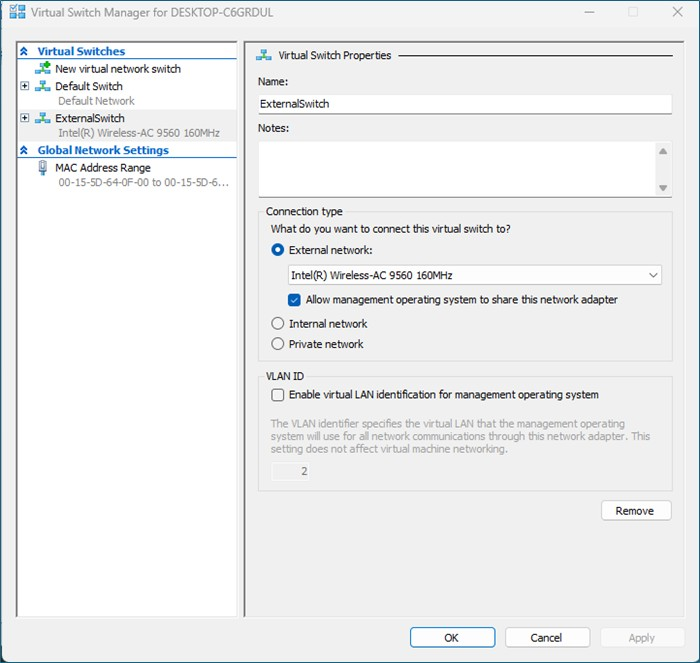
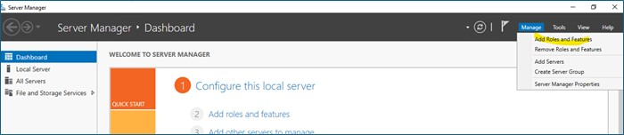
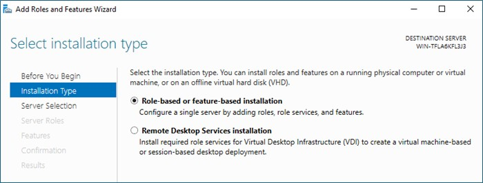
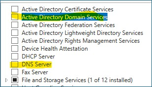
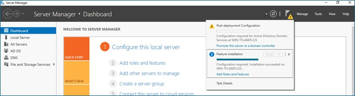
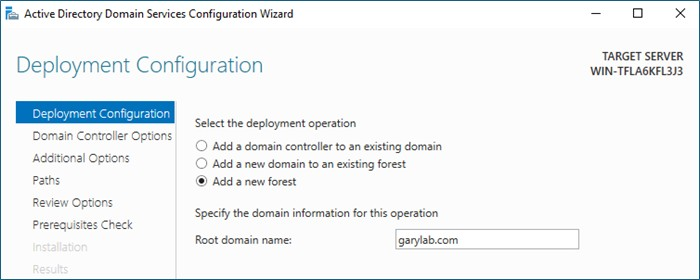
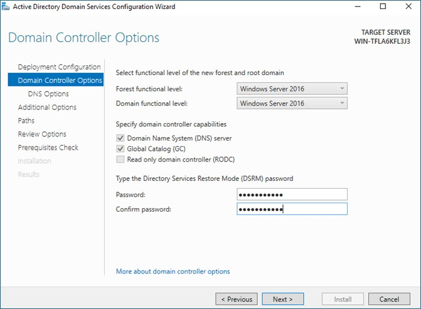
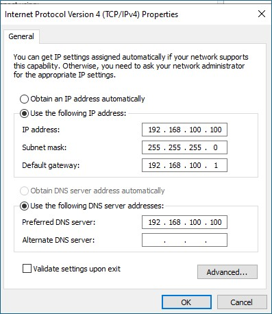

# Active Directory Domain Services (AD DS) & DNS Installation & Configuration

The purpose of this AD DS & DNS is created as part of Azure Stack HCI / Azure Local lab.  
It is created as a Virtual Machine on Hyper-V.

## Install on Hyper-V as Virtual Machine

### Create & Configure Hyper-V External Switch

1. Open Hyper-V Manager > Click on my host machine name.
2. Go to "Virtual Switch Manager".
3. Click "New virtual network switch" > Select "External" > Click Create Virtual Switch.
4. Name it - "External Switch".
5. Under "Connection type", select my laptop’s active network adapter.
6. Check "Allow management operating system to share this network adapter" 
7. Click OK.

### Create Windows Server 2022 VM in Hyper-V
1. Create "New" > "Virtual Machine".
2. Following the wizard;
    - Fill in the Name.
    - Selected Generation 2.
    - Allocated 4GB for memory
    - Select "ExternalSwitch" for networking.
    - Specify a folder to store the Virtual Hard Disk (can use the default, but I prefer to specify in manual created folder for easy to clean up later on).
    - Choose "Install on operating system from a bootable CD/DVD-ROM" and select the Window Server 2022 ISO.
    - Click Finish and wait to boot up to installation wizard.
    - Choosed to install "Windows Server 2022 Standard (Desktop Experience)". (Easy to navigate with GUI).
    - Follow the wizard and wait for installation to complete.

### Windows Server 2022 Configuration & Install AD DS & DNS

1. Configure a static IPv4 address.
2. Configure to use the DNS server to use Google DNS - "8.8.8.8" for temporary. (Will change once enable the Windows Server as DNS feature).
3. Go to Server Manager and select "Add roles and features".

4. Select "Role-based or feature-based installation".

5. Select local server (the server itself).
6. Install Roles - "Active Directory Domain Services & DNS Server".

7. Once complete installation, click on "Promote this server to a domain controller".

8. Than it will prompt Active Directory Domain Services Configuration Wizard.
9. Add a new forest and specify the root domain name.

10. Set the Directory Services Restore Mode (DSRM) password.

11. At DNS option leave it default.
12. For NetBIOS Name leave it default.
13. Click Next for the subsequent steps and lastly click Install.
14. Wait till complete installation.
15. Once server rebooted, go back to the network options and set the DNS server to the server IP address itself.  

### Create Organization Unit (OU),Sub-OU,Users, and Groups.
The following hierachy created for this lab:

1. UsersAccount (OU)
    - IT (Sub-OU)
        - ituser1@garylab.com (User)
        - ituser2@garylab.com (User)
        - itmanager1@garylab.com (User)
    - HR (Sub-OU)
        - hruser1@garylab.com (User)
        - hrmanager1@garylab.com (User)
    - Sales (Sub-OU)
    - Marketing (Sub-OU)
2. WorkGroups (OU)
    - GRP_HR_Admins (Security Group)
    - GRP_IT_Admins (Security Group)
    - GRP_Marketing_Admins (Security Group)
    - GRP_Sales_Admins (Security Group)
3. WorkServers (OU)
4. WorkComputers (OU)
5. Created a domain admin account - garyadmin@garylab.com. 

## Resources
- Windows Server 2022 Evaluation ISO: https://www.microsoft.com/en-us/evalcenter/evaluate-windows-server-2022
- Hyper-V: https://learn.microsoft.com/en-us/windows-server/virtualization/hyper-v/get-started/install-hyper-v?tabs=gui&pivots=windows