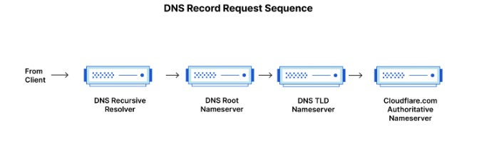
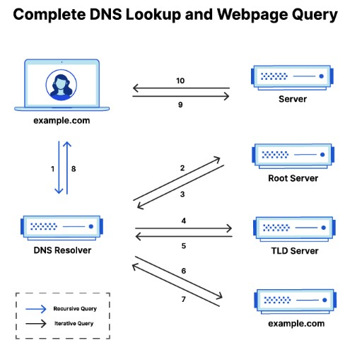

# DNS Basic

### Configure local machine to resolve

`vi /etc/hosts`  
Add IP address and the hostname
`192.168.1.1 mytest`

### Add DNS Server for machine
`vi /etc/resolv.conf`  
Add the following nameserver  
`nameserver 8.8.8.8`

#### DNS resolution order is controlled by "/etc/nsswitch.conf"

`cat /etc/nsswitch.conf`  

Output  
`hosts: files dns`  
This means the system check the local `/etc/hosts` file first because `files` is first and then query the DNS server `dns`.

## How DNS Work? How Webpage is being load?

#### There are 4 DNS servers involved in loading a webpage
*Note: Credits to https://www.cloudflare.com/learning/dns/what-is-dns/*

- __*DNS recursor*__ -  The recursor can be thought of as a librarian who is asked to go find a particular book somewhere in a library. The DNS recursor is a server designed to receive queries from client machines through applications such as web browsers. Typically the recursor is then responsible for making additional requests in order to satisfy the client’s DNS query

- __*Root nameserver*__ - The root server is the first step in translating (resolving) human readable host names into IP addresses. It can be thought of like an index in a library that points to different racks of books - typically it serves as a reference to other more specific locations.

- __*TLD nameserver*__ - The top level domain server (TLD) can be thought of as a specific rack of books in a library. This nameserver is the next step in the search for a specific IP address, and it hosts the last portion of a hostname (In example.com, the TLD server is “com”).

- __*Authoritative nameserver*__ - This final nameserver can be thought of as a dictionary on a rack of books, in which a specific name can be translated into its definition. The authoritative nameserver is the last stop in the nameserver query. If the authoritative name server has access to the requested record, it will return the IP address for the requested hostname back to the DNS Recursor (the librarian) that made the initial request.

---

---

### Steps in a DNS Lookup

The 8 steps in a DNS lookup:  
1. A user types ‘example.com’ into a web browser and the query travels into the Internet and is received by a DNS recursive resolver.
2. The resolver then queries a DNS root nameserver (.).
3. The root server then responds to the resolver with the address of a Top Level Domain (TLD) DNS server (such as .com or .net), which stores the information for its domains. When searching for example.com, our request is pointed toward the .com TLD.
4. The resolver then makes a request to the .com TLD.
5. The TLD server then responds with the IP address of the domain’s nameserver, example.com.
6. Lastly, the recursive resolver sends a query to the domain’s nameserver.
7. The IP address for example.com is then returned to the resolver from the nameserver.
8. The DNS resolver then responds to the web browser with the IP address of the domain requested initially.  
*Once the 8 steps of the DNS lookup have returned the IP address for example.com, the browser is able to make the request for the web page:*
9. The browser makes a HTTP request to the IP address.
10. The server at that IP returns the webpage to be rendered in the browser (step 10).

---

---

### DNS Caching
- Temporary stored data in a location that results in improvement in performance and realiability for data requests.
- Store the data closer to the requesting client so that DNS query can be resolved earlier and additional queries further down the DNS lookup chain can be avoided.
- Improve load time, reduce bandwidth and CPU consumption. 
- DNS can be cached at variety locations, each of which will store DNS records for a set amount of time determined by a time-to-live (TTL).
- Example - Browser DNS Caching & Operating Sytem (OS) level DNS Caching

### DNS Testing Tools

| Tool       | Protocol | Port   | Use Case                                 |
|------------|----------|--------|-------------------------------------------|
| nslookup   | UDP/TCP  | 53     | Basic DNS queries                         |
| dig        | UDP/TCP  | 53     | Detailed DNS queries and advanced options |

#### nslookup

- Simple DNS query tools default on Windows, macOS and Unix/Linux
- Uses **UDP port 53** by default
- Falls back to **TCP port 53** if response is too large

Example;  

        nslookup example.com
        nslookup example.com
        nslookup -type=MX gmail.com

#### dig
- For deep diagnostics
- **UDP port 53** by default
- ** TCP port 53** for large responses or `+tcp` flag

Example;

        dig example.com
        dig MX gmail.com
        dig @1.1.1.1 example.com
        dig +tcp example.com
